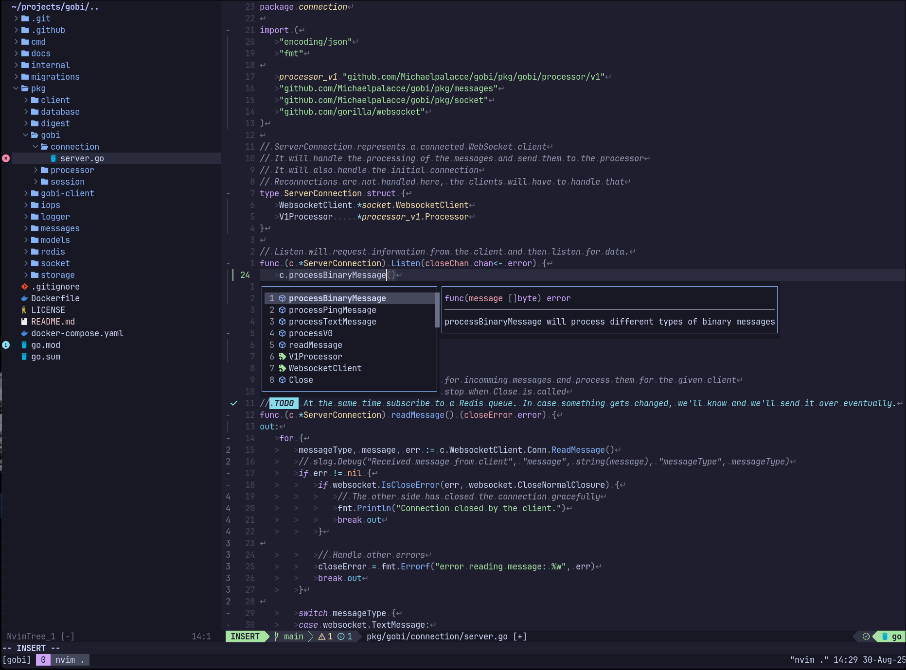

# `Tis It Folks

## Showcase

<p align="center">

</p>

<details>
    <summary>Debugging</summary>
    
</details>

<details>
    <summary>Scripts</summary>
    
</details>

<details>
    <summary>Cheatsheets</summary>
    
</details>

<details>
    <summary>Automated idempotent setup</summary>
    
</details>

## Supported OS

- [x] Ubuntu
- [x] MacOS
- [ ] Arch

## Roadmap

- [x] Lazy loading as many Plugins as possible
- [ ] Higher stability for Plugins... Should be more mindful of errors 

## Setup

Run the setup script. It will prompt for sudo password if one is needed.
For MacOs, we need brew installed.

```bash
curl -o- https://raw.githubusercontent.com/Michaelpalacce/.dotfiles/master/setup.sh | bash
```

## Philosophy

- Be as native as possible with keybindings. Don't rely too much on remaps, know how to do without plugins.
- Lazy Load everything. Commands/completions/etc need to be lazy loaded if possible.
- Good separation of resources. Make sure things make sense and it's understood what x is for.
- Document as much as possilbe. You won't remember in a few days let alone a few months.
- Speed is the number one factor always.

## Structure

- `Home` - this contains a bunch of ansible recipes that can be used to install a few tools for Ubuntu.
    - Used to like ansible, but I much preffer things being as native as possible and I am not setting up a server, so I would say they are deprecated
- `bin` - Check out the [#Scripts] section for this,
- `cheatsheets` - this contains some local cheatsheets that I can access at any time with `sc`
- `editorconfig` - this contains my default editorconfig that gets used everywhere
- `gitignore` - Default gitignore for common directories/files you want to ignore
- `iterm2` - I am having an existential crisis here, I kidna wanna migrate to `alacritty` everywhere
- `nvim` - Personalized Development Environment in NeoVim
- `scripts` - Extra scripts I need to run
- `sh` - `zsh` configuration
- `tmux` - `tmux` configuration

## Aliases

I am not a big fan of using aliases, cause honestly I tend to forget what I set. My methodology includes using aliases for as little as possible.

The main aliases that get added would also be remaps in Neovim (this can be observed in the `remaps.lua` and `.zsh_aliases`).

### What is `stow`?

`stow` is a symlink manager that allows us to create symlinks based on folders.

Example:
```ascii
.dotfiles/
├─ nvim/
│  ├─ .config/
│  │  ├─ nvim/

```

On the given folder structure, if you run `stow nvim` from `.dotfiles`, a Symlink will be created to `~/.config/nvim` ( aka from the home dir, whatever the structure was inside the `nvim` folder )

### Installing brew

For MacOS, we need homebrew installed... this is outside of the install script, so run this manually

> bash -c "$(curl -fsSL https://raw.githubusercontent.com/Homebrew/install/HEAD/install.sh)"

## Scripts

### tmux-exxegutor

A helper utility that allows me to run code in the background, or the foreground. 
Essentially it contains a bunch of local build commands for different languages.

### tmux-cht

A helper utility that will either query cheat.sh or open up local cheatsheets, defined in `$HOME/.config/cheatsheets/`
Provides functionality to delete and create cheatsheets.

### tmux-identity-theft

A helper utility for switching different identities, for example: `.npmrc`, `~/.m2/settings.xml`, etc. It utilizes symlinks and expects you to have put the
alternative identities with the originals. Example:

```
.npmrc
.npmrc.vmware
.npmrc.public
```

### tmux-sshuttle-daddy

`tmux-sshuttle-daddy` is a utility tool designed to assist with VPN connections using sshuttle.
It requires sshuttle to be installed. 
The utility reads your ~/.ssh/known_hosts file and prompts you to either select from the existing IPs or specify a new one."

### tmux-timer

Starts a new timer in a separate tmux window. Will prompt you for 2 arguments if they are not given.

### tmux-wttr

Shows the weather forecast in another tmux windows.

