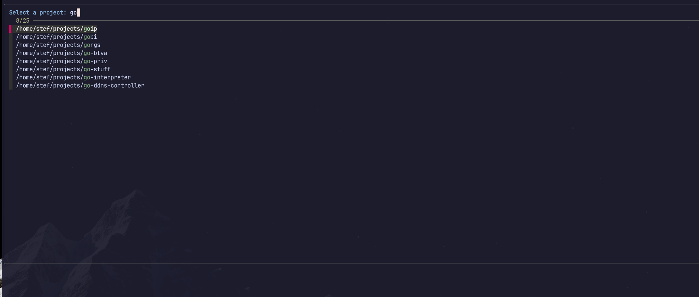

# `Tis It Folks

These are my personal dotfiles. They are heavily opinionated and they are not meant to be used by anyone else,
but I am open to suggestions and improvements. I am not using any fancy dotfile manager, 
but instead I am using a bunch of bash scripts and `stow` to create symlinks to the appropriate locations.

## Dependencies

The following dependencies are needed to run the setup script:

- `curl` - for downloading the setup script
- `git` - for cloning the repositoryA
- `brew` - for **MacOs** fully set up. In order to use brew, make sure to do

## 📦 Setup

The setup script will setup and configure the local development environment.
Run the setup script. It will prompt for sudo password if one is needed.

```bash
curl -o- https://raw.githubusercontent.com/Michaelpalacce/.dotfiles/master/setup.sh | bash
```

### Setup Identity

After running the setup script, you will need to run the following command to setup your ssh identity.
As this may contain sensitive information, it is not included in the main setup script.
Note: you need to have the correct `age` private key in `~/.config/sops/age/keys.txt` for this to work. This is stored in a private place

```bash
curl -o- https://raw.githubusercontent.com/Michaelpalacce/.dotfiles/master/setup-identity.sh | bash
```

### Setup Home Manager

After completing the initial setup, you can choose to install home-manager. The default zshrc config has special conditions and handles if
home-manager exists, to include it.


```bash
curl -o- https://raw.githubusercontent.com/Michaelpalacce/.dotfiles/master/setup-homemanager.sh | bash
```

## ✨ Showcase

<p align="center">

</p>

<details>
    <summary>Debugging</summary>
    
</details>

<details>
    <summary>Scripts</summary>
    
</details>

<details>
    <summary>Cheatsheets</summary>
    
</details>

<details>
    <summary>Automated idempotent setup</summary>
    
</details>

<details>
    <summary>tmux-sessionizer</summary>
    
</details>

## Supported OS

I use these dotfiles on the following Operating Systems

- [x] Arch
- [x] MacOS

Note: Will support whatever I work on.

## Philosophy

- Prioritize native keybindings and minimal plugin reliance. NeoVim being the plugin exception... I can't pass on the hot new thing
- Lazy load all resources.
- Ensure clear resource separation.
- Document extensively for future reference.
- Always prioritize speed.

##  Details

### Structure

- `Home` - this contains a bunch of ansible recipes that can be used to install a few tools for Ubuntu.
- `alacritty` - Contains my alacritty configurations
- `bin` - Check out the [#Scripts](#scripts) section for this,
- `cheatsheets` - this contains some local cheatsheets that I can access at any time with `sc`
- `editorconfig` - this contains my default editorconfig that gets used everywhere
- `gitignore` - Default gitignore for common directories/files you want to ignore
- `home-manager` - Contains my home-manager configuration. Used to setup dev tools primarily
- `nix` - Contains some nix configuration, `.config/nix` to be exact. I don't use NixOS
- `nvim` - Personalized Development Environment in NeoVim
- `scripts` - Extra scripts I need to run
- `sh` - `zsh` configuration
- `tmux` - `tmux` configuration

### Neovim

Neovim is heavily modified to match my needs. Those needs are admittedly constantly changing, so my configuration will end up 
changing with it.

I try to keep the native capabilities of vim and use them as much as possible, however a lot of quality of life changes are done.

### Home-Manager

I use `home-manager` to manage my development environment in a declarative way.

`home-manager swtich` to set up the environment.

Since I use `home-manager` for darwin and linux, my `home.nix` contains logic around that matter. 
I don't really see this behaviour that often with people's configurations, which is why I am mentioning it.

### Aliases

I am not a big fan of using aliases, cause honestly I tend to forget what I set. My methodology includes using aliases for as little as possible.

The main aliases that get added would also be remaps in Neovim (this can be observed in the `remaps.lua` and `.zsh_aliases`).

### What is `stow`?

`stow` is a symlink manager that allows us to create symlinks based on folders.

Example:
```ascii
.dotfiles/
├─ nvim/
│  ├─ .config/
│  │  ├─ nvim/

```

On the given folder structure, if you run `stow nvim` from `.dotfiles`, a Symlink will be created to `~/.config/nvim` ( aka from the home dir, whatever the structure was inside the `nvim` folder )

### Installing brew

For MacOS, we need homebrew installed... this is outside of the install script, so run this manually

> bash -c "$(curl -fsSL https://raw.githubusercontent.com/Homebrew/install/HEAD/install.sh)"

### Scripts

#### tmux-cht

A helper utility that will either query cheat.sh or open up local cheatsheets, defined in `$HOME/.config/cheatsheets/`
Provides functionality to delete and create cheatsheets.

#### tmux-identity-theft

A helper utility for switching different identities, for example: `.npmrc`, `~/.m2/settings.xml`, etc. It utilizes symlinks and expects you to have put the
alternative identities with the originals. Example:

```
.npmrc
.npmrc.vmware
.npmrc.public
```

#### tmux-sshuttle-daddy

`tmux-sshuttle-daddy` is a utility tool designed to assist with VPN connections using sshuttle.
It requires sshuttle to be installed. 
The utility reads your ~/.ssh/known_hosts file and prompts you to either select from the existing IPs or specify a new one."

#### tmux-timer

Starts a new timer in a separate tmux window. Will prompt you for 2 arguments if they are not given.

#### tmux-wttr

Shows the weather forecast in another tmux windows.

#### tmux-chooser

Forces `tmux` if a normal terminal is opened. It will also ask which tmux session to attach to if there are multiple.

